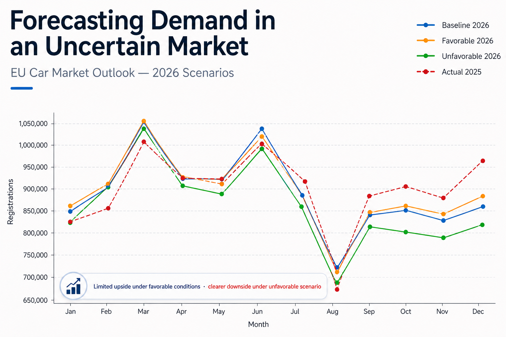

# EU Car Registrations Forecasting — ACEA + Macro Indicators

This project develops an end-to-end forecasting workflow for EU new passenger car registrations using ACEA data combined with macroeconomic indicators. The final output is a 2026 monthly forecast under baseline, favorable, and unfavorable scenarios.

## Project objective

The goal is to test whether combining historical registration patterns with macroeconomic and market indicators can improve short-term forecasting of EU car registrations versus a simple seasonal baseline.

## Scope

- Time frame used for model development: 2022–2025
- Forecast horizon: 2026 monthly registrations
- Main target variable: `acea_total_registrations`
- Geographic focus: EU aggregate, built from country-level ACEA registration data
- Final model family: Ridge regression pipeline with scaled features, benchmarked against baseline, Random Forest, and XGBoost variants

## Data sources

The project combines several source families:

1. **ACEA monthly registration reports**  
   Used to extract new car registrations by market and power source.

2. **OECD macroeconomic indicators**  
   Used for unemployment, consumer confidence, CPI / inflation, short-term interest rates, GDP growth, and real final consumption.

3. **EU fuel price data**  
   Used for petrol and diesel price indicators.

4. **Industry indicators**  
   Used as supporting market context where available.

> Note: Raw source files and large intermediate datasets are not included by default. The notebooks expect a local `data/` folder.

## Repository structure

```text
.
EU-Car-Registrations-Forecasting/
│
├── data/
│   ├── bronze/
│   │   └── acea_pdfs/
│   ├── silver/
│   └── gold/
│
├── notebooks/
│   ├── 1_data_ingestion_and_preparation/
│   │   ├── 01_acea_pdf_download.ipynb
│   │   ├── 02_acea_registration_parsing.ipynb
│   │   ├── 03_oecd_macro_kpi_extraction.ipynb
│   │   └── 04_industry_data_preparation.ipynb   (optional / restricted)
│   │
│   ├── 2_data_preparation/
│   │   └── 05_master_dataset_consolidation.ipynb
│   │
│   ├── 3_modeling/
│   │   ├── 06_feature_engineering_and_testing.ipynb
│   │   ├── 07_baseline_model.ipynb
│   │   └── 08_macro_model_development.ipynb
│   │
│   └── 4_forecasting/
│       └── 09_2026_scenario_forecasting.ipynb
│
├── outputs/
│   ├── forecast_plot.png
│   └── forecasting_framework.png
│
├── README.md
├── requirements.txt
└── .gitignore
```

## Modeling approach

The modeling process follows four steps:

1. Build a clean monthly panel of ACEA registrations and macro indicators.
2. Engineer lagged registration, rolling average, seasonality, and macro lag features.
3. Compare baseline, macro linear regression, Ridge, Random Forest, and XGBoost models using time-based backtesting.
4. Use the selected model pipeline to generate 2026 scenario forecasts.

## Validation approach

The project uses an expanding-window rolling backtest. For each forecast month, the model is trained only on prior months and then tested on the next unseen month. This avoids random train/test leakage and better reflects a real forecasting setup.

## Scenario design

The 2026 forecast uses three scenarios:

- **Baseline:** central macro and market assumptions
- **Favorable:** lower-energy / more supportive market conditions
- **Unfavorable:** adverse energy and weaker demand conditions

The forecast should be interpreted as a structured scenario exercise, not as a deterministic prediction.

## Results

The final output of the project is a monthly forecast of EU car registrations for 2026 under three scenarios.

Key observations:

- The baseline scenario suggests a relatively stable market with moderate growth compared to 2025  
- The favorable scenario shows upside potential driven by improved macroeconomic conditions and lower energy costs  
- The unfavorable scenario highlights downside risks under higher inflation and weaker demand  

The final forecast is constructed using a hybrid Ridge approach, combining two model specifications to improve robustness and stability.



## Additional context

For a more detailed walkthrough of the methodology, modeling choices, and business interpretation, see the full article:

👉 https://www.linkedin.com/pulse/can-macroeconomic-signals-really-help-us-anticipate-market-hassan-lttue/

This complements the technical implementation presented in this repository.

## Key Outputs

The project produces several outputs to support analysis and interpretation:

- Forecasting framework diagram (see `outputs/forecasting_framework.png`)
- Final 2026 scenario forecast (see `outputs/forecast_plot.png`)
- Detailed methodology and interpretation (see linked article)

## Tech stack

- Python (pandas, numpy, scikit-learn, xgboost)
- Data extraction: PDF parsing (pdfplumber), API ingestion (OECD)
- Modeling: Linear regression, Ridge, Random Forest, XGBoost
- Visualization: matplotlib
- Workflow: Jupyter notebooks

## Reproducibility notes

Before running the notebooks, create the expected folders and install the required Python packages:

```bash
pip install -r requirements.txt
```

Some notebooks rely on locally saved parquet files and trained model objects. These should be generated by running the notebooks in order.
